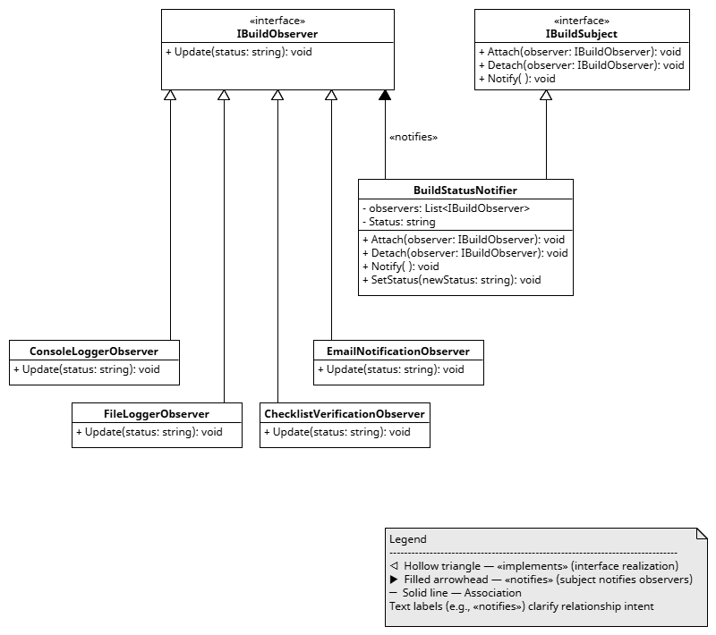

# Observer Pattern — BuildStatusNotifier


## Overview
This project demonstrates the **Observer** design pattern using a build‑status notification scenario.  
The pattern defines a one‑to‑many dependency between objects so that when the subject changes state, all registered observers are automatically notified.

This example is intentionally designed as a clear, educational reference for students, educators, and recruiters evaluating software‑engineering fundamentals.

---

## UML Diagram
The following UML class diagram illustrates the structure of the Observer pattern in this project:



---

## Participants

### **IBuildSubject (interface)**
Defines the contract for managing observers:
- `Attach(observer)`
- `Detach(observer)`
- `Notify(status)`

### **IBuildObserver (interface)**
Defines the contract for receiving updates:
- `Update(status)`

### **BuildStatusNotifier (concrete subject)**
Maintains a list of observers and notifies them when the build status changes.

### **Concrete Observers**
Each observer implements `IBuildObserver` and reacts to status updates:
- `ConsoleLoggerObserver` — writes updates to the console  
- `FileLoggerObserver` — writes updates to timestamped log files  
- `EmailNotificationObserver` *(simulated)*  
- `ChecklistVerificationObserver` *(simulated)*  

---

## Intent of This Example
This example models a realistic workflow where multiple components need to react to build‑status changes.  
It demonstrates:
- Loose coupling between subject and observers  
- Dynamic registration and removal of observers  
- A clean, interface‑driven design  
- How real CI/CD systems broadcast events to independent components  

This project is structured to be **interview‑ready** and **classroom‑ready**, with clarity and intentionality in every file.

---

## Logging Lifecycle (Application + CI/CD)

### **Application‑Level Logging**
The `FileLoggerObserver` generates:

- Timestamped log files:  
  `log_YYYYMMDD_HHMMSS.txt`
- UTC timestamps for reproducibility  
- A header row documenting the log format  
- Clear run boundaries:  
  - `START OF RUN`  
  - `END OF RUN`  

Each run produces a self‑contained, readable log file.

### **Workflow‑Level Logging (GitHub Actions)**
A GitHub Actions workflow automatically:

- Promotes the newest log to `latest_log.txt`  
- Appends workflow activity to `automation_log.txt`  
- Archives older logs  
- Ensures the repo always displays a fresh example log  

This models operational hygiene and artifact lifecycle management in CI/CD systems.

### **Scheduled Daily Maintenance (GitHub Actions)**

A second GitHub Actions workflow performs lightweight daily maintenance to keep the repository healthy over time.  
This scheduled job:

- Appends a daily audit entry to `automation_log.txt`  
- Enforces a retention policy (keeps the **last 10** timestamped logs)  
- Trims `automation_log.txt` if it grows beyond a safe threshold  
- Ensures all maintenance actions are fully visible and never destructive  

This models real‑world scheduled automation, log rotation, and operational hygiene while preserving the educational value of the repository.

---

## Repository Structure

```
Pattern-Observer-BuildStatusNotifier/
├── BuildStatusNotifierApp/
│   ├── Config/
│   │   └── Paths.cs
│   ├── Interfaces/
│   │   ├── IBuildObserver.cs
│   │   └── IBuildSubject.cs
│   ├── Observers/
│   │   ├── ConsoleLoggerObserver.cs
│   │   └── FileLoggerObserver.cs
│   ├── Subject/
│   │   └── BuildStatusNotifier.cs
│   ├── Logs/
│   │   ├── latest_log.txt
│   │   ├── automation_log.txt
│   │   └── log_YYYYMMDD_HHMMSS.txt (multiple)
│   └── Program.cs
├── .github/
│   └── workflows/
│       └── log-management.yml
│       └── daily-maintenance.yml
├── docs/
│   └── Pattern-Observer-BuildStatusNotifier.png
└── README.md
```

This layout intentionally mirrors real-world engineering practices:

- **Clear separation of concerns**  
  Interfaces, observers, subjects, and configuration each live in their own folders.

- **Predictable, discoverable structure**  
  Students and recruiters can instantly locate the part of the pattern they want to study.

- **Dedicated logging directory**  
  Keeps runtime artifacts organized and supports CI/CD log promotion and archiving.

- **Workflow automation isolated under `.github/workflows`**  
  Matches industry conventions and keeps CI/CD logic separate from application code.

- **Documentation stored under `docs/`**  
  Ensures diagrams and teaching materials remain versioned and accessible.

---

## Why This Matters

This repository is intentionally structured as a **teaching-quality artifact**, not just a code sample.  
The organization demonstrates several professional engineering principles:

- **Reproducible engineering**  
  The logging pipeline, timestamped files, and workflow automation show how real systems track and manage build artifacts.

- **Operational maturity**  
  CI/CD promotes the newest log, archives older ones, and maintains an automation audit trail — all common in production pipelines.

- **Extensibility through interfaces**  
  New observers (email, dashboards, alerts) can be added without modifying the subject, illustrating the power of loose coupling.

- **Clarity for students and recruiters**  
  Each folder has a single responsibility, making the pattern easy to understand and navigate.

- **Intentional design**  
  Every file, folder, and workflow exists for a reason — and the README explains that reason.

This structure helps learners see not only *what* the Observer Pattern is, but *how* it fits into a realistic engineering environment.

---

## Running the Project Locally

From the repository root:

```
dotnet build
dotnet run --project BuildStatusNotifierApp/BuildStatusNotifierApp.csproj
```

You will see console output such as:

```
Build started
Compiling...
Running tests...
Build succeeded
```

A new log file will appear in:

```
BuildStatusNotifierApp/Logs/
```

with full run boundaries and UTC timestamps.

---

## Current Implementation Status
The following components are complete:

- Interfaces (`IBuildSubject`, `IBuildObserver`)  
- Concrete subject (`BuildStatusNotifier`)  
- Console logger observer  
- File logger observer (timestamped, UTC, run boundaries)  
- Working demo wired together in `Program.cs`  
- CI/CD workflow for log promotion, archiving, and automation tracking  

You can run the project now to see the Observer pattern in action.

---

## Coming Next

### **C# Implementation**
- Email notification observer (simulated)  
- Checklist verification observer (simulated)  
- Additional example usage patterns  

### **Documentation**
- Expanded teaching notes  
- Additional diagrams  
- Observer Pattern FAQ  

---

## Teaching Notes
This repository is designed to help students and early‑career developers understand:

- When to use the Observer pattern  
- How loose coupling improves extensibility  
- How real systems broadcast events to multiple independent components  
- How to structure a clean, readable C# project  
- How CI/CD pipelines manage logs and artifacts  

The project intentionally balances **clarity**, **realism**, and **educational value**.
